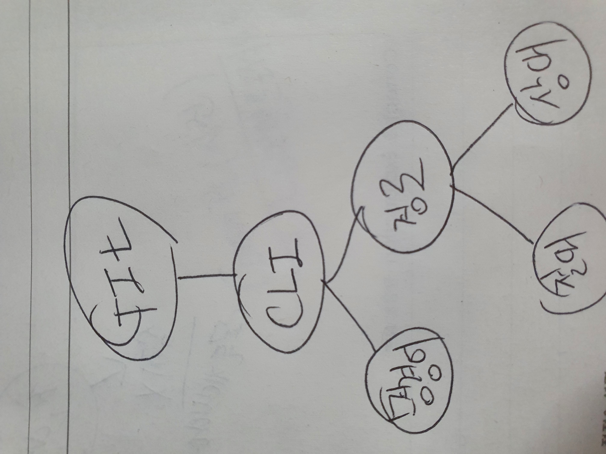

# GIT 과 GITHUB

----

### Git : 버전관리 프로그램

### GitHub : 코드저장 온라인 공간(구글드라이브 같은것)

 

1. CLI command Line Interface : 명령으로 움직임

2. 명령어 command : git bash
3. 경로
   - 상대경로 : 생략 주소
   - 절대경로  : cd 로 시작해서  절대 안바뀜

# 2. git intro

1. repository( 저장소)

   git init 하면 만들어짐

2. commit(사진찍는 개념)

3. git 순서

   - git add (무대로 올린다)
   - git commit -m ""(사진을 찍는다)
   - git push (Hub에 올린다~)

# 3. 추가적인 사항

1. git check out
